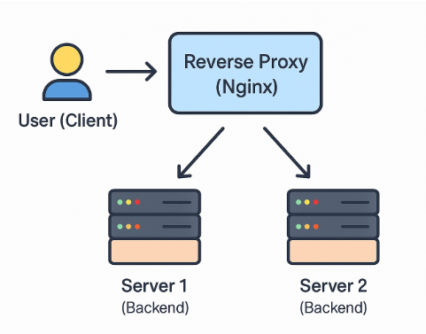
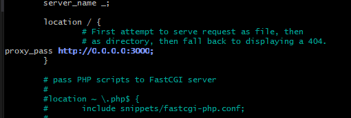

# Cloud Computing Guide

## What is Cloud Computing?
- **Cloud computing** is the delivery of computing services (servers, storage, databases, networking, software, etc.) over the internet ("the cloud") instead of using local on-premises infrastructure.
- Pay as you go services.

## How to Identify On-Prem vs. Cloud?
- **Identify simply:**
  - Anything that is acessed through the internet.
    - Example: Adobe creative = Cloud based programs (not downloading the programs like photoshop)
  - Online storage:
    - OneDrive, google drive - Cloud storage. 
- **On premesis** = Managed on private physical servers/data centers.
- **Cloud** = Hosted by a cloud provider, accessible over the internet.
- **Hybrid** = Mix of both 
  - **HMLR use a hybrid setup. Why?**
    - Security & Compliance → Government agencies handle sensitive data and often keep critical systems on-premises for compliance.
    - Scalability → Cloud services help handle peak demand (e.g., property transactions).
    - Cost Efficiency → Hybrid cloud optimizes cost by using on-prem for core systems and cloud for scalable workloads.
    - Business Continuity → Cloud backups improve disaster recovery & resilience.

## Popular Cloud Computing Services & Uses
- Google drive
- DropBox
- Netflix
- The big 3:
  - **AWS** Best for Scalability & Versatility:
    -  Great for startups, enterprises, and e-commerce (Shopify, Netflix).
  - **Azure** Best for Enterprises & Microsoft Integration:
    - Ideal for corporations using Microsoft tools (Office 365, Windows Server).
    - Best for hybrid cloud and government compliance.
    - Strong in AI and enterprise security.
  - **Google Cloud** Best for AI & Big Data:
    - Best for AI, machine learning, and big data analytics
    - Preferred by tech startups and media companies (YouTube, Unity).
    - Focused on cost efficiency

## Four Cloud Deployment Models
1. **Public Cloud** = Shared infrastructure (AWS, Azure, GCP).
2. **Private Cloud** = Dedicated infrastructure for one organization.
   - You are the sole tenant.
3. **Hybrid Cloud** = Mix of private & public cloud.
   - Example = Got a database running on a private cloud but you want some benefits of leveraging the public cloud provider.
4. **Multi-Cloud** = Using multiple cloud providers.
   - Why?
     - Avoids Lock-in so you’re not stuck with one provider.
     - Better Performance – Use the best services from different clouds.
     - More Reliability – If one cloud goes down, others keep things running.
     - Cost Savings – You can pick cheaper options across providers.

## Three Main Cloud Service Models
1. **IaaS (Infrastructure as a Service)** = Virtual machines, networking (AWS EC2, Azure VM).
2. **PaaS (Platform as a Service)** = Managed development environments (Google App Engine)
3. **SaaS (Software as a Service)** = Fully managed software (Google Workspace, Dropbox).
   - Further to the right in the image you go the less you have to manage yourself.

## Main Advantages of Cloud Computing
- [x] **Scalability** = Grow/shrink resources as needed.
- [x] **Cost-Effective** = Pay-as-you-go pricing.
- [x] **Reliability** = Backups & disaster recovery.
- [x] **Security** = Advanced encryption & compliance.

## Disadvantages of the Cloud
- Dependency on Internet, no internet = no access.
- Security & Compliance Risks
- Hidden Costs = Data transfer & storage fees add up.

## Market Share: Biggest Cloud Providers (2024)
- **AWS** 32% = Leader, broadest services.
- **Azure** 23% =  Strong enterprise focus.
- **Google Cloud** 11% = AI/ML, big data.

## Best Cloud Provider & What They’re Known For
- **AWS** = Best for startupss, scalability, and variety.
- **Azure** = Best for enterprise & microsoft integrations
- **GCP** = Best for AI, machine learning and big data.

## What Do You Pay for in the Cloud?
- Compute (VMs, containers, functions).
-  Storage (object, block, databases).
-  Networking (data transfer, load balancers).
-  Managed Services (AI, security, monitoring).

## Four Pillars of DevOps & Their Cloud Link
1. **Collaboration** = Cloud enables shared environments & CI/CD.
2. **Automation** = Infrastructure as Code (IaC) automates cloud setups.
3. **Monitoring** = Cloud offers real-time observability tools.
4. **Security** = Cloud-native security tools for compliance & protection.