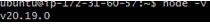
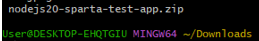

# Manual App Deployment Guide
This guide will walk you through the steps to manually deploy the Sparta application on an AWS instance, from setup to running the app in your environment.

## Manually Deploying the Sparta App

#### Notes from Devs:
- Webserver required = nginx
- NodeJs Version required = 20.x
- Runs on port 3000
- To start the app:
  - cd into app
  - `npm install`
  - `npm start app.js`
  - Will run in the foreground by default
- Database integration will be done at a later date
- Access the app at http://public-ip:3000

### Step by Step Guide
#### What is Nginx?
- Nginx is a web server that can also function as a reverse proxy, load balancer, and HTTP cache. It handles incoming web traffic, serving static content and directing requests to other servers or applications as needed. It’s known for being fast, efficient, and scalable.

#### Run an AWS instance
- Ensure you have the security groups:
  1. Port 80
     - Type: HTTP
     - Source Type: Anywhere IPv4
     - Source: 0.0.0.0/0
  2. Port 3000
     - Type: Custom TCP
     - Source Type: Custom
     - Source: 0.0.0.0/0
  3. Port 22
     - Type: ssh
     - Source: 0.0.0.0/0
- These settings will allows you to run and connect to the app later.

#### Installing Nginx
- `sudo apt update `
  - Updates the list of available packages on the instance to ensure your system is aware of the latest versions and security updates.
- `sudo apt upgrade -y`
  - This command upgrades installed packages ensuring all the latest patches and updates are applied automatically.
- `sudo apt install nginx -y`
  - This installs Nginx on your instance.
- `sudo systemctl restart nginx`
  - This restarts the Nginx service to apply the configuration changes. It’s important to restart the service so that Nginx starts using the updated settings.
- `sudo systemctl enable nginx`
  - This ensures that Nginx will start automatically whenever the instance is rebooted, making sure your web server is always running without manual intervention.

#### Installing NodeJs Version 20.x
- `curl -fsSL https://deb.nodesource.com/setup_20.x | sudo -E bash - &&\
sudo apt-get install -y nodejs`
  - This command uses `cURL` to download the Node.js setup script for version 20.x.
  - The `-fsSL` flags ensure the command runs quietly, following redirects and handling errors properly.
  - The script adds the Node.js 20.x repository to your system’s package sources.
  - `sudo -E` ensures that the environment variables are preserved while running the script, allowing Node.js to be installed with proper permissions.
  - `sudo apt-get install -y nodejs` Installs NodeJs from the repository added in the previous step.
- `node -v`
  - Checks the version installed to verify.

#### Downloading App Code
- `cd Downloads`

- `sudo apt install unzip -y`
  - This installs unzip if you don't have it already.
- `unzip <filename.zip>`
  - Unzips the sparta app code.
- `cd <extracted-folder-name>`
  - Moves into the unzipped directory.

#### Installing NPM (Node Package Manager)
- NPM (Node Package Manager) is a tool that comes with Node.js and is used to install, manage, and update dependencies for JavaScript applications.
- `cd <app code directory name>`
- `cd <app directory name>`
  - Ensure you change into the app directory
- `sudo npm install`
  - Installs all required dependencies listed in the package.json file for the application.
- `sudo npm install pm2 -g`
  - Installs PM2, a process manager for Node.js applications. 
  - The -g flag makes it globally available, allowing the app to be run and managed in the background.
- `pm2 kill`
  - Stops and removes all currently running PM2 processes.
  - Ensures no previous instances interfere with the new deployment.
- `pm2 start app.js &`
  - Starts the Node.js application (app.js).
  - The & runs it in the background, so the terminal remains free.

- Load the page `<public ip address:3000>`

#### If it doesnt connect to the app:
- Add "port 3000" and source "0.0.0.0" to the application instance security group settings. 
- By default, AWS security groups block incoming traffic. Adding port 3000 with source 0.0.0.0/0 allows external access to the running application. This ensures requests can reach the app from any IP.

- Reload the page `<public ip address:3000>`

