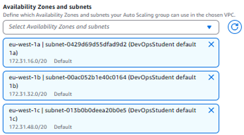

# Autoscaling & Load Balancing Guide
This guide shows you how to set up Auto Scaling and Load Balancing for a web application in AWS.

## What is a Launch Template in AWS?
A Launch Template is like a saved blueprint for launching EC2 instances. It stores settings like the AMI, instance type, key pair, security groups, and more.

## What is Auto Scaling in AWS?
Auto Scaling automatically adds or removes EC2 instances based on demand. You set rules (like CPU > 70%), and AWS scales up or down to match.

## What is Load Balancing in AWS?
A Load Balancer (usually an Application Load Balancer) sits in front of your EC2 instances and evenly distributes incoming traffic across them.

## Why Use Auto Scaling with Load Balancing?
They work great together:
- Auto Scaling adjusts the number of instances you have.
- Load Balancer makes sure traffic goes to healthy, available instances.
- When new instances are added by Auto Scaling, the Load Balancer starts using them automatically.
- If an instance fails, it's removed from both the group and the Load Balancer.

## Web App Example: Auto Scaling + Load Balancer
1. Run a web app on EC2 instances
2. Always have at least 2 and at most 3 instances
3. Keep CPU usage under 50%
4. Automatically distribute traffic with a Load Balancer

## What You’ll Use
- **Launch Template** – defines how to create your EC2 instances (AMI, instance type, etc.)
- **Auto Scaling Group** (ASG) – handles instance scaling
- **Application Load Balancer** (ALB) – balances incoming traffic across instances

## Step By Step Guide

### Step 1: Create a Launch Template

Navigate to the "instances" drop down menu on the left hand side of youre screen and select "Launch Templates"

Choose a launch template name and description. Remeber this is going to be used to launch instances for the application so make it meaningful.

Also make sure to select the "Auto Scaling guidance" checkbox as this is for EC2 auto scaling help (our instance is on EC2)

Select your AMI that you made which contains the ready to launch application inside it.

As for instance type - Select "t.2 micro".

Select your "key pair" and "security group" that you have already created and use dpreviously.

Click the dropdown menu for "Advanced detrails" and scroll down until you see "user data"

This is where you will input your own user data script which you made previously.

User data is used to run the commands on the instance to start the app without needing to connect to it through SSH.

**Mine may be different to yours**

Finally your ready to click "create" to launch the template.

### Step 2: Testing The Launch Template

It's important to test the launch template works correctly by launching an instance from the template itself. 

To begin the test, select the "actions" drop down on the "Launch Template details" page.

Make sure you add a **resource tag** and give it a name. This ensures the instance created from the launch template has a name.

Make sure the information looks correct in the summary and click "Launch instance"

Open up a new web page and paste the new instance's public ip address in the search bar. This may need some time to launch the app.

It should display the application as seen in the screenshot below:

**Test is complete!** The launch template worked and was able to launch the application through the new instance.

However, the instance was still created manually. This step is what is going to be automated next.

## Step 3: Create an Auto Scaling Group & Load Balancer

Navigate to the "Auto Scaling" section in the left menu bar on your AWS window. Select "Auto Scaling Groups"

First, choose the launch template we created earlier. 

Skip the isntance type.

**Network settings** are crucial and need to be changed.

- Network settings define where your instances will run (VPC, subnets) and how they connect to the internet or other services. They ensure your Auto Scaling Group launches instances in the right environment with proper access and security.

Select these availability zone options:
- DevOpsStudent default 1a
- DevOpsStudent default 1b
- DevOpsStudent default 1c

Select "Balanced best effort" for the Availability Zone distribution.
- This setting spreads instances evenly across Availability Zones when possible. This improves fault tolerance and helps your app stay available even if one zone has issues.

Next, select "Attach to a new load balancer" inside the Load Balancing section.
- It connects your Auto Scaling Group to a Load Balancer, so new instances automatically receive traffic.
- It ensures smooth traffic distribution and keeps only healthy instances serving users.

Make sure to select "Application Load Balancer" for the Load balancer type as the application runs on HTTP.

Choose a load balancer name. Then select "Internet-facing" as the Load balancer scheme.
- This is so that end users can access the application (online).

Availability zones should be filled out correctly due to selecting them previously. 

Ensure you select port 80 (HTTP) and "create a new target group" in the "Listeners and routing" section. 
- Selecting port 80 (HTTP) and creating a new target group lets the Load Balancer know where to send traffic and how to check instance health.

Skip the "VPC Lattice integration options" as well as "Application recovery controller (ARC)" as they are not needed.

Next, select the "Turn on Elastic Load Balancing health checks" check box.
- This allows the Load Balancer to monitor the health of each instance. The Auto Scaling Group will automatically remove unhealthy instances and replace them with new ones, ensuring that only healthy instances receive traffic.

Leave the "Health check grace period" as 300 seconds.
- It gives new instances time to initialize and become healthy before health checks start, preventing premature scaling actions.

Select next.

Enter a "Group Size" desired capacity of **2**.

As for scaling, set the minimum desired capacity to **2** and the maximum desired capacity to **3**. 
Also make sure the "Target tracking scaling policy is checked"
- enables the Auto Scaling Group to dynamically adjust the number of instances based on a set target, like CPU utilization. AWS automatically scales the group to maintain the desired performance (e.g., keeping CPU under 50%) by adding or removing instances as needed.

Enter a new name for the "scaling policy name" but keep othe roptions in that section the same.

- These options will check the "Average CPU utilisation". If CPU utilization goes over 50%, the Auto Scaling Group will automatically launch an extra (backup) instance to handle the increased load.

Skip the "Instance maintenance" policy as it charges more.

Select the default capacity settings.

Leave the "Additional settings" blank.

- Instance scale protection prevents specific instances from being terminated automatically during scale-in events (when the group removes instances).
- It helps protect critical or long-running instances from being accidentally deleted, keeping your app stable and reliable.

Skip the "notifications (optional) section"

Add a tag to name the Autoscaling security group.

Select next and then "Create Auto Scaling group"

## Step 4: Test the Auto Scaling Group Is Running

Select the "instances" tab in the left menu on your AWS window. Type the name of your Auto Scaling Group and see if it is running.

The two instances (minimum 2) are running.

You can also see the two different availability zones (1c and 1b) that they are utilising.

Optional: You can select the public ip address of each instance to check if the app is running on them correctly.

However this means manual checking whereas using DNS name in Load Balancing would make this easier.

## Step 5: Testing Load Balancer

Select "Load Balancers" inside the "Load Balancing" section on the left side of your AWS window.

Copy the DNS name info and paste it into a new google window:

- By using the DNS name of the Load Balancer, traffic is routed to any healthy instance in the group. It doesn’t point to a specific instance like an IP address would.
- This ensures your app stays accessible and highly available, even if individual instances change or get replaced.

## Step 6: Testing the Auto Scaling Group When Deleting Instances (below minimum desired)

Locate one of the instances and "Terminate (delete) instance".

The Auto Scaling Group should kick in and make a second instance automatically as the minimum required instances (apps running) is two.

It should launch an instance automatically as seen below:

##### *Auto Scaling & Load Balancing Guide Complete* 

