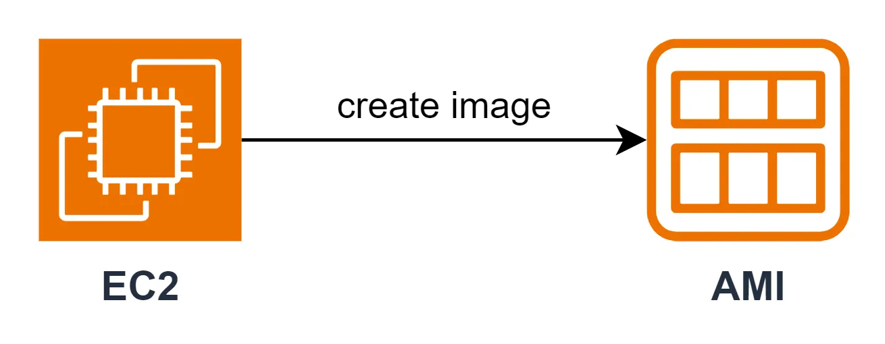
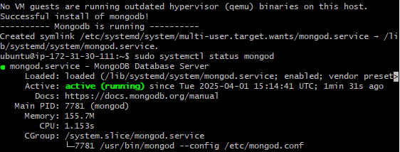
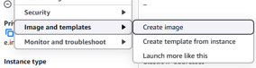
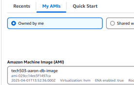
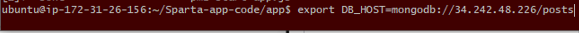
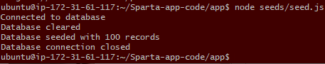
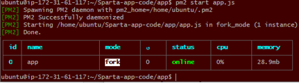
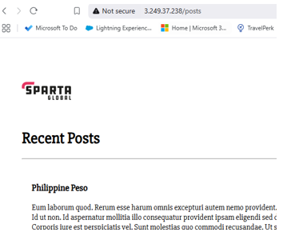

# Creating A Custom AMI
This guide covers what AMIs are, their benefits, and step-by-step instructions for creating and using them.

## What is an image?
- An Amazon Machine Image (AMI) is a pre-configured template that includes an operating system, software, configurations, and sometimes data (In my case my MongoDB instance "snapshot"). They allow you to quickly launch new EC2 instances with the same setup as your exisiting one.

## How do they work?
- You create an AMI from an existing EC2 instance. This AMI can then be used to launch multiple identical instances without having to reinstall or configure everything manually. 
- In this case: 
  - The MongoDB NoSQL database program is installed on the first EC2 instance manually (or using a script).
  - Stopping the instance here and creating an AMI from this instance is essentially taking a snapshot of this current instance.
  - The snapshot ensures that each new instance that is created using the new custom AMI starts with pre-loaded data (MongoDB).

## How AMI's are useful for businesses?
- Consistency: Ensures all servers have the same software and configurations.
- Faster Deployment: New instances are ready to use immediately, saving setup time.
- Scalability: Easily launch multiple identical instances as demand increases.
- Backup & Recovery: AMIs with snapshots can act as backups, allowing quick recovery from failures.
- Automation: Can be integrated with auto-scaling to dynamically add or remove instances.
- An AMI with preloaded resources makes it easier for less tech-savvy users by providing a ready-to-use setup, eliminating the need for manual installation and configuration. It simplifies deployment, reduces errors, and saves time.

## Creating an AMI: Step-by-Step Guide

#### Setting Up the Base Instance for AMI Creation:
- The first thing is to deploy an EC2 instance with the Ubuntu AMI on AWS.
- Next, run a script on the instance which would install MongoDB. 

- Run `sudo systemctl enabel mongod` 
- This command will ensure MongoDB remained persistent in that it will start MongoDB on start up without manual assistance.
- With the instance set up, it is ready for a snapshot and create the custom AMI from it at this state.

#### Creating an AMI from the Instance on AWS
- First step, stop the instance. This is crucial as the AMI cannot be created on a running instance.
- Use the "Actions" tab and click "Image and templates" -> "Create Image".

- Creating the image inside the actions tab will essentially create the snapshot of the current instance state.
- Create a name for your AMI and description for future reference.

- Click "Create" to begin the process of creating your custom AMI. 2. Wait for the AMI creation to complete. This may take a bit longer than usual as it needs to install dependencies from the MongoDB snapshot.
- Once it is running then "Terminate" the origional EC2 instance as it's no longer needed.

#### Deploying Instances with Your Custom AMI
- Launch a new instance but this time use "My AMI's" in the "Application and OS Images" section.

- Use your SSH key pair.
- Ensure the security group has port 27017 (tcp) 
  - port 27017 is the default port used by MongoDB for client connections. This allows the connection between the two instances later on.
- Click "Create" to create the instance.
- Again, this new instance should have MongoDB installed automatically due to the snapshot taken.

#### Testing the Custom AMI Instance
- In my case, the MongoDB contains the database the application uses after connecting to it.
- Launch the application instance (which also uses port 27017).
- Navigate to the application directory.
- run the enviroment variable command: `export DB_HOST=mongodb://<Database IP Address>/posts`
- How the enviroment variable works:
  - The environment variable stores the database connection details (like the database's IP address, port, and credentials)
  - The application instance then reads this variable to know how to connect to the database.
  - This way, the application can securely access the database without hardcoding the connection details directly in the code.

- `printenv DB_HOST` Allows you to verify that the environment variable was set correctly.
- `node seeds/seed.js` Populates the database with test data. How it does this: 
  - It is commonly referred to as a "Seeding script".
  - It connects to the database, often using an ORM like Mongoose (for MongoDB) or an SQL library.
  - The script inserts the defined data into the appropriate collections or tables in the database.

- The seed was successful if it shows the "Database was seeded with 100 records"

- `pm2 start app.js` Starts the app.

- Lastly, check the app launched correctly and contains the test data (/posts) from the database. 

- The app shows the test data in /posts which confirms it was successful.