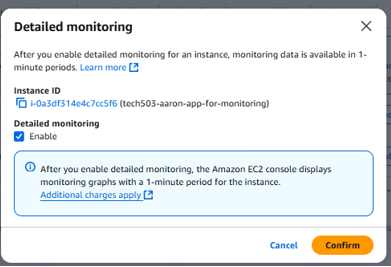
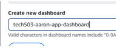
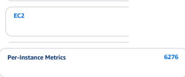
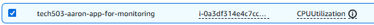
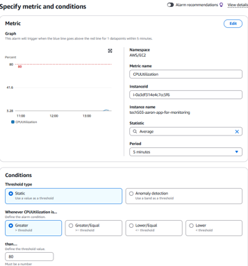
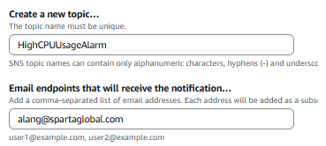
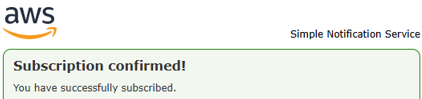
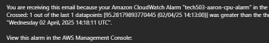

# Creating Monitoring Dashboards & Alarms
This guide provides step-by-step instructions on how to create a CloudWatch alarm for an EC2 instance, configure it to monitor specific metrics (e.g., CPU utilization), and test the alarm by simulating high usage.
## Why Are Alarms Important?
- CloudWatch alarms help automate monitoring by detecting performance issues, system failures, or unusual activity in real-time. They allow AWS users to:
  - Receive alerts (via email, SMS, or AWS SNS) when thresholds are exceeded.
  - Improve system reliability by proactively responding to issues.
  - Optimize costs by detecting resource overuse.

## Creating a monitoring dashboard:
Step by step guide.
### Configuring Enhanced Monitoring
- To begin, click the "detailed monitoring" link inside the "monitoring" tab on your AWS instance summary.

- Ensure you tick the checkbox to enable detailed monitoring

- Configuring the enhanced monitoring is now complete at this stage.

### Creating the dahshboard
- First click the "add to dashboard" link on the top right of the open monitoring tab.
  - This adds the enhanced monitoring to a dashboard.
- Next, create a new dashboard:

  - Ensure you select "create" before adding to dashboard. This will create the dashboard itself before you add it.
- Once you click "add to dashboard" you have successfully created the dashboard and added the enhanced monitoring to it.

### CREATING AN EC2 USAGE ALARM (CPU-Usage)
#### Navigate to CloudWatch
- Navigate to the menu bar on the left hand side of your cloudwatch page (dashboard)
- Select "Alarms" drop down, and click "all alarms".
- Next, click the "create alarm" link.
#### Select an EC2 Instance Metric
- In the Browse tab, navigate to:
  - EC2 & Per-Instance Metrics

- Use the search bar to find your EC2 instance by instance ID or name.
- Select the metric you want to monitor (e.g., CPUUtilization for CPU usage).
- Click Select metric to proceed.

#### Define Alarm Conditions
- Under Statistic, choose Average (default) or another option based on your needs.
- Under Period, select how often CloudWatch should evaluate the metric (e.g., 1 minute for real-time monitoring).
- Set the Threshold Type:
  - Choose Static for a fixed value (e.g., CPU usage > 80%)
- Set the Threshold Value:
  - Example: Greater than 80% for CPU utilization.
- Click next to continue.

#### Set Alarm Actions
- Under Notification, choose what happens when the alarm triggers:
  - Select Create a new notification (or use an existing one).
  - Click Create New SNS Topic.
  - Enter a Topic Name (e.g., EC2-HighCPU-Alert).
  - Enter sparta email address to receive alerts.

  - Click "create topic" and "Next" to proceed.
  - Enter a name (e.g. tech503-aaron-app-alarm)
  - Click "Create Alarm"
  - You will receive an email to the email address supplied. CLick "confirm subscription" to accept the alarm.

### Testing the Alarm
- Connect to the instance via SSH.
- Run the following command to simulate high CPU usage for 1 minute: (or however long you select)
  - `stress --cpu 2 --timeout 60s`
- Wait for the CloudWatch alarm to trigger.
- Check your email/SNS notification to confirm the alert was received.

