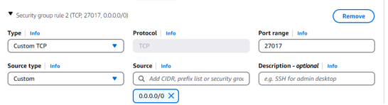
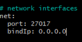
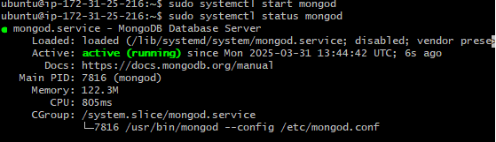

# MongoDB Manual Deployment Guide
This guide will walk you through the steps to manually deploy MongoDB, from setting up the environment to running your instance, ensuring you're ready for data storage.

## What is MongoDB?
MongoDB is a NoSQL database that stores data in flexible, JSON-like documents instead of traditional tables. It’s designed for scalability and handling large amounts of unstructured or semi-structured data.

## Deploying MongoDB Manually: Step-by-Step Guide

#### Notes from Devs:
- Ubuntu 22.04
- Mongo version 7.0.6
- Need following components: 
  - org 
  - database 
  - server 
  - mongosh
  - mongos
  - tools
- Need to connect app to db on APP machine
  - Will need to use an environment variable. String should be:
    - DB_HOST=mongodb://<db-ip-address>:27017/posts

### Monolith vs 2-Tier Deployment Types
- **Monolith**: A single, unified application where all components (frontend, backend, database) are tightly integrated. It's simpler to deploy but can become hard to manage as it grows.
- **A 2-tier deployment**: Refers to an architecture where the application is split into two layers:
  1. Client (Application Layer): This is the frontend or user interface of the application that interacts with the user. The application communicates directly with the backend (MongoDB database) to fetch or store data.
  2. MongoDB (Database Layer): The backend consists of MongoDB, where data is stored and retrieved. The application sends queries to MongoDB to interact with the database.

### Step by Step Guide:
#### Launch the database instance on AWS.
- Use same SSH key pair.
- Create a new security gorup:
  - Add default MongoDB port (27017)
  - Used the source: 0.0.0.0/0 to allow anyone to connect for training purposes.

- Connect to the database instance through gitbash using ssh.

#### Install MongoDB
- `sudo apt update` 
  - Downloads the latest package list from the repositories configured. 
  - This doesn't actually run them so it can't break anything.
- `sudo systemctl stop packagekit` 
  - Stops any interactive screens.
- `sudo apt upgrade` 
  - Compares what the repository has vs what is newer.
  - This one can actually break things.
- `sudo apt install gnupg curl -y` 
  - Installs gnupg and curl (already installed but good to run anyway)
  - **GnuPG** = GnuPG (GPG): Used during MongoDB installation to verify the authenticity of the MongoDB package. It ensures the software you download hasn’t been tampered with.
  - **cURL** = A tool used to download MongoDB installation scripts or packages from the internet. It helps fetch the necessary files directly from MongoDB’s servers.
- `curl -fsSL https://www.mongodb.org/static/pgp/server-7.0.asc | \
    sudo gpg -o /usr/share/keyrings/mongodb-server-7.0.gpg \
   --dearmor` The command ensures that the GPG key corresponds to the specific version of MongoDB (in this case, version 7.0) by downloading the key associated with that version. This verifies the authenticity of the MongoDB 7.0 packages during installation.
  - No output to the terminal means it worked.
- `echo "deb [ arch=amd64,arm64 signed-by=/usr/share/keyrings/mongodb-server-7.0.gpg ] https://repo.mongodb.org/apt/ubuntu jammy/mongodb-org/7.0 multiverse" | sudo tee /etc/apt/sources.list.d/mongodb-org-7.0.list` 
  - **This tells your computer where to get the MongoDB software from.** It adds the MongoDB 7.0 repository to your system’s package sources. It uses the GPG key you downloaded earlier to ensure the packages are secure. Specifically, it:
    - Creates a new repository list: Adds the MongoDB 7.0 repo to the system's sources list for Ubuntu.
    - Ensures security: Uses the previously saved GPG key to verify the authenticity of MongoDB packages.
- **In short:** It sets up the MongoDB 7.0 repository for installation and secures it with the GPG key.
- `sudo apt update` 
  - Updates package list and makes sure the system knows that we want version 7.0 of mongoDB. Rather than the latest version. 
  - Version 7.0 was requested by DEVS and was stated in the previous echo command.
- `sudo apt install -y mongodb-org=7.0.6 mongodb-org-database=7.0.6 mongodb-org-server=7.0.6 mongodb-mongosh=2.1.5 mongodb-org-mongos=7.0.6 mongodb-org-tools=7.0.6` 
  - Now the system knows about MongoDB 7.0 and where to get it from, you run the install command. This actually downloads and installs MongoDB and all the necessary components (like the database, server, and tools).

#### Getting MongoDB Up and Running
- The first step is to change the MongoDB config file, as this is where key settings like network interfaces, data storage paths, and security options are defined.
- Navigate to the /etc directory (config files)
- `cd /etc`
- `sudo nano mongod.conf`
  - Opens the mongod.conf file. Sudo is essential as it allows you to save the changes made to the file.
- Navigate to the **network interfaces** block inside the mongod.conf file.
- Change the bindIp to **0.0.0.0** 
  - This allows MongoDB to accept connections from any IP address, as set in the security group. This ensures MongoDB can communicate with external servers or clients.
  - It matches the AWS security group settings set previously.

- Save changes to the mongod.conf file and exit.
- `sudo systemctl start mongod`
  - This starts MongoDB.
- `sudo systemctl status mongod`
  - This checks if MongoDB is running now that the changes have been made to the .conf file. 
  - This confirms that MongoDB is accessible from other machines, which is necessary when the security group is set to allow connections from a specific IP or range.

#### Complete

